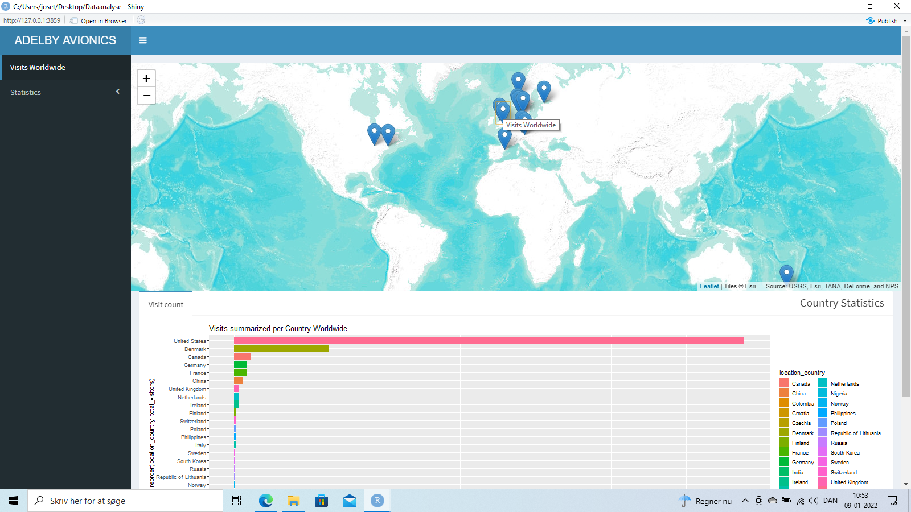

```{r setup, include=FALSE}
knitr::opts_chunk$set(echo = FALSE)
```

```{r}
pacman::p_load("tidyverse", "magrittr", "nycflights13", "gapminder",
"Lahman", "maps", "lubridate", "pryr", "hms", "hexbin",
"feather", "htmlwidgets", "broom", "pander", "modelr",
"XML", "httr", "jsonlite", "lubridate", "microbenchmark",
"splines", "ISLR", "MASS", "testthat", "caret", "gbm",
"RSQLite", "class", "babynames", "nasaweather", "pls",
"fueleconomy", "viridis", "boot", "devtools", "tree",
"glmnet", "gam", "akima", "factoextra", "randomForest",
"ggrepel", "GGally", "fmsb", "sjPlot", "rcompanion",
"leaps", "caretEnsemble", "rpart", "rpart.plot", "xgboost",
"ggplot2", "mapdata", "readxl", "dplyr")
```


**ABSTRACT**

Adelby Avionics is a three year old company, who develops and produces instruments for smaller airplanes.
Until now Adelby Avionics has developed three different products.
In my period of internship I have done different types of market research, especially focused on customers, dealers and pricing, and I have begun the construction of a shiny dashboard for showing metrics directly fetched from an API on the company's server.
In general it has been a positive experience working for Adelby Avionics. The products are interesting and the company has potential to be data-driven, though it for now still is in the beginners face. The lack of data has given some problems in the internship as general, as there were none to begin with, and at this moment only has been initiated in smaller scale. But I feel that I have had some influence over time, and more steps have recently been taken to make the company data-driven in the future both according to consumer data and product data.

# Praktikrapport - Adelby Avionics


## Indledning

Først og fremst har jeg set det som min opgave, at kunne bidrage med en en ny vinkel på det at være datadrevet. Adelby Avionics, fremover kaldet "AA", startede på bar bund datamæssigt i begyndelsen af min praktikperiode. Det er dog lykkedes at få virksomheden startet op i en bane, der på længere sigt kan give mulighed for indsamling af forskellige data, mest kundeoplysninger.
Ejeren af virksomheden, Nis Adelby Clausen, har været åben overfor en udvikling mod en mere datadrevet virksomhed, selvom dette har krævet omlægning af visse ting, herunder hjemmeside.


## Beskrivelse af virksomheden AA

AA er en enkeltmandsvirsomhed (ingen ansatte) som udvikler og producerer instrumenter til mindre fly.
Virksomheden startede ultimo 2019 og har intil videre udviklet og produceret en elektronisk horisont, som er videreudviklet i 3 forskellige varianter.
Mens jeg var i pratik gik AA fra at være et enkeltmandsforetagende, over IVS til idag at være et APS.

## Virksomhedens problematikker i relation til dataindsamling og datamodenhed

Det har fra starten af været tydeligt for mig, at AA ikke havde de fornødne foranstaltninger til at opsamle og behandle data, hvilket er det samme som at sige, at virksomedens datamodenhedsniveau var meget lavt, nærmest ikke eksisterende.
Specielt så jeg det som vigtigt, at AA fik nogle oplysninger om sine kunder, for i fremtiden at kunne tilpasse udvikling og markedsføring.
Det var også tydeligt, at Nis Adelby Clausen mest interesserede sig for at udvikle nye produkter, ikke at sælge dem, hvilket salget idag bærer præg af.
AA´s stærke side er dog, at der er ressourcer til teknologisk udvikling og tilpasning på højt plan, hvilket betyder, at virksomheden på længere sigt har gode muligheder for at blive datadrevet.

## Mine opgaver i AA

Generelt har det været let at arbejde i AA og Nis Adelby Clausen har været lydhør overfor mine ideer.
Desværre har Corona bremset vores bestræbelser på at komme ud fysisk til klubber og messer, og derfor har mit arbejde været koncentreret om det jeg kunne lave fra skrivebordet og over telefonen.
Jeg har lavet flere markedsundersøgelser. De vigtigste set fra mit synspunkt er positionering og prisfastsættelse, samt en undersøgelse af forhandlernettet.
Ud over markedsundersøgelser har jeg brugt meget tid på R og RStudio, fordi jeg har ønsket at blive en god programmør, der i fremtiden også kan hjælpe andre virsomheder med Machine Learning.
I forbindelse med logning og lagring af eventuelle data fra AA, har jeg gjort Nis Adelby Clausen opmærksom på den juridiske del af opgaven, herunder de begrænsninger dette måtte medføre.

## AAs datamodenhedensniveau

Som udgangspunkt for vurderingen af AAs datamodenhedsniveau fik jeg i foråret 2021 Nis Adelby Clausen til at tage en test på Nettet. Testen viste at virksomheden lå på det laveste datamodenhedsniveau.
Der blev ialt testet på 10 forskellige datapunkter. Opsummerende viste testen følgende:

### Generel dataindsamling

AA laver regnskab og samler data om salg og overskud. Virksomheden samler også data om hvor hvilke potentielle kunder befinder sig på verdenskortet. Men en ting er at indsamle data, en anden at anvende de indsamlede data.
AA befinder sig ifølge testen på trin 1, hvor virksomheden bevæger sig fra at blot rapportere data til at begynde at analysere på data. Jeg har i denne forbindelse været initiator til udviklingen fra kun at indsamle data til at begynde at bruge disse til analyseformål.
Samtidig har jeg brugt tid på at diskutere og vurdere hvilke data der er vigtige at analysere på. Dette beror på hvor virksomheden befinder sig udviklingsmæssigt. AA er fortsat i startfasen, hvor det gælder om at komme ud på markedet med produkterne og få solgt.
De data jeg primært har valgt ud til at analysere på er positionerings-, pris- og kundedata. Det har set fra mit syndspunkt været vigtigt at gå ind i markedet med den rette pris i forhold til kvalitet og produktgodkendelser (tso-godkendelse).

#### Sikring af virksomhedens data

Som et led i mit praktikforløb har jeg diskuteret sikring af virksomhedens data med Nis Adelby Clausen.
AA råder over sin egen server og har firewall og kryptering udadtil. Og der er ingen ansatte med adgang til virksomhedens data, og endnu ingen forhandlere med adgang til filer. Programkode er gemt lokalt og kun med adgang fra Nis Adelby Clausen.

### Raportering af "metrics"

AA har udviklet sig på dette punkt siden testen. I min praktikperiode er virksomheden gået fra ingen (læs 0) aktivitet til nogen aktivitet (læs 1) indenfor dette område. Dette skyldes at jeg har initieret at AA fik udviklet en API på sin server, således at jeg kunne præsentere lagrede data fra APIen i et shiny-dashboard.
AA havde allerede et dashboard, der fulgte med interfacet i virksomhedens e-handels-hjemmeside fra "Shopify". Men Shopifys datavisualisering af metrics vedrørende geografiske søgehits manglede nyance, og derfor har jeg udviklet et dashboard, der kan udbygges med tiden. Dette betyder også, at jeg ikke er færdig med denne opgave, fordi den vokser med virksomhedens udviklingsniveau og ønske om øget datamodenhed.

### Virksomhedens styrker og svagheder arbejdsopgavemæssigt

AA er en højteknologisk virksomhed, der har stort potentiale ingeniørmæssigt, men samtidig en virksomhed med mangler på markedsførings- og salgssiden.
Indtil videre betyder dette styrke-/svagheds- forhold, at AA idag råder over tre forskellige produktvarianter af samme produkt, men kun to solgte eksemplarer af den første type. Det skal dog her tilføjes, at udvikling tager tid, og at AA på dette punkt at gjort et efter min mening godt valg ved at udvikle videre på en skrabet model for at lave et produkt med mulighed for datalogning.
Jeg mener selv at have haft indflydelse på dette valg, da jeg har spurgt til produkternes evne til at kunne opsamle funktionsdata under brug.

Datamodenhedstesten anbefalede AA at opsøge ekstern hjælp til opbygning af et analyseprogram og at fokusere på tidlig succes, herunder salg af enheder, for at samle momentum (kraft) til fremtiden.
Førstnævnte har jeg været en del af, da jeg har været med til at hjælpe virksomheden igang med indsamling af relevante data, samt opbygning af et dashboard til visning af disse data. Salgsmæssigt har jeg kun hjulpet med markedsanalyse og positionering, samt prisfastsættelse og listning af potentielle forhandlere.

### Teknologi, Lederskab og virksomhedskultur

AAs force er evnen og viljen til at udvikle ny teknologi, samt herunder muligheden for på sigt at blive en moderne datadrevet virksomhed, der tager beslutninger på baggrund af målbare enheder. Virksomhedens leder og ejer, Nis Adelby Clausen, er enerådende i beslutningstagning og teknologisk udvikling, og kan lade dette gå hånd i hånd mod en positiv status i fremtiden. Jeg vil i denne forbindelse stå ved sidelinjen og være behjælpelig med den faglighed jeg råder over. Og med viljen til på sigt at fastholde et datadrevet mindset, kan AA opbygge en organisation, der grundlæggende integrerer data som en naturlig del af virksomhedens kultur.

### AAs datastrategi

Under min tid i praktik hos AA har Nis Adelby Clausen, så vidt jeg er i stand til at vurdere, fået bedre forståelse for hvad det vil sige at være datadrevet, og også fået en interesse i at anvende data, som basis for beslutningstagning i virksomheden. Et eksempel er at AA har fastsat prisen på sit første produkt ud fra min undersøgelse af positionering og prisrelationen. Positive tilbagemeldinger fra flyejere har understøttet dette valg. Datastrategien er langt fra færdigudviklen, men blot i begyndelsesfasen. Det er står klart er, at de vigtigste data at fokusere på lige nu, er kundedata. Derfor udbygningen af et dashboard til geografisk positionering af potentielle kunder.

## Forskellige deskresearch

AA havde ingen former for markedsundersøgelsesmateriale da jeg begyndte i praktikken, og jeg så det derfor med min baggrund som markedsanalytiker, som en nødvendighed at lave forskellige deskresearch, der kunne anvendes som baggrund for det videre forløb, ikke blot for min praktikperiode, men for virsomheden i fremtiden som helhed.

### Grundlæggende markedsundersøgelser

Den første tid som praktikant har jeg anvendt til at få et overblik over de problemstillinger, som AA står overfor. Bl.a. havde virksomheden ingen prispolitik, eller prisfastsættelse, og den pris, der var valgt til dette nye firmas første produkt var alt for høj, hvilket betod, at der intet blev solgt.
Derfor var jeg i begyndelsen nødt til at lave en desk-research over markedet for instrumenter til mindre fly. Denne viste bl.a. at der var en sammenhæng mellem antallet af funktioner i instrumentet og prisen. En anden faktor, som påvirkede prisen var hvorvidt produktet var tso-godkendt. En tso-godkendelse koster ca. 40.000,- kroner og er et certifikat for at instrumentet opfylder kravene til at dette kan anvendes til instrumentflyvning, og ikke kun visuel-flyvning. AAs kunstige horisont Seagull-05 er ikke tso-godkendt og kan derfor kun sælges til fly, der normalt ikke bruges til instrumentflyvning, som f.eks. svævefly og ultralette fly.
Ved hjælp af machine learning har jeg lavet en prisfastsættelse til produktet ud fra antal funktioner og om produktet er tso-godkendt eller ikke. Det har fungeret godt, og jeg har fået positive tilbagemeldinger fra AA, som siden har anvendt min analyse i forbindelse med det udvidede sortiment.
Da jeg begyndte min praktik havde AA ingen positioneringsstrategi, og jeg brugte derfor Porters 5 Forces til at lave en. Jeg fokusserede på at det var fordelagtigt, at holde en høj kvalitet til en indbydende introduktionspris. Som positioneringsinstrument anvendte jeg specifikt “The Strategy Clock”.


```{r}
AA_posit <- read_excel("AA-Position.xlsx")


clock <- ggplot(data=AA_posit, aes(x=Price, y=Perceived_product_benefits, color=Product)) +
  
  coord_polar("y", start=0) +
  geom_point(aes(x=Price, y=Perceived_product_benefits, color=Product)) +
  ggtitle("Porters Strategy clock")
  
  
clock

```

Generelt ligger AA fint postitioneringsmæssigt med en pris på 10.000 kroner pr. enhed og en kvalitet i den høje ende. Sidsnævnte er målt ud fra kritiske succesfaktorer, herunder batteritid, brugervenlighed og montage-sværhedsgrad.

### Udvælgelse af fokusmarkeder

På grund af de begrænsninger den manglende tso-godkendelse gav var det fornuftigt at fokusere salgsindsatsen et sted hvor instrumentflyvning ikke var et krav, og AA valgte at gå efter Ultralette fly, som det første marked. Alle ultralet-klubber i Danmark blev kontaktet for at blive interviewet om hvorvidt de kunne have interesse i Seagull-05. Samtidig blev produktet testet af udvalgte konkurrence-svævefly-piloter, som installerede en prototype i deres fly. AAs marked er således ikke afgrænset geografisk, men begrænset ud fra flytype.

### Problematikker omkring produktet

Det har været tydeligt, at de mest solgte kunstige horisonter har indholdet mere end 1 funktion, og derfor har AA valgt at lave varianter af den oprindelige Seagull-05. Idag er der 3 varianter inklusive det oprindelige produkt. De nye varianter indholder mulighed for at kunne logge data af flyvningen og efter landing lægge dem over på en pc, eller ud på Nettet.

### Kritiske succesfaktorer

De viktigste kritiske succefaktorer for AAs produkter er: lang batteri-tid p.g.a. lavt strømforbrug i forhold til konkurrenternes, nem montering i eksistende instrumentbræt og nem betjening af instrumentet. Specielt det lave strømforbrug er en vigtig konkurrenceparameter. Seagull-05 forbruger en tiendedel strøm i forhold til den nærmeste konkurrent. En pilot, skal kunne anvende radioen under hele flyvningen, og derfor er det specielt vigtigt i svævefly, som ingen generator har, at instrumterne har et lavt strømforbrug. I visse situationer kan dette endog være livsvigtigt, f.eks. under konkurrenceflyvning i øde områder i Australien.

### Undersøgelse af det globale forhandlernet

AA er i princippet et enkeltmandsfirma, og derfor kan det være en fordel at outsource salget. Jeg har derfor undersøgt markedet og lavet en liste over alle verdens forhandlere af flyinstrumenter. I skrivende stund har AA kontaktet en stor amerikansk forhandler af flyinstrumenter for at høre om muligheden for at kunne sælge derigennem.

### Nuværende salgssituation

P.t. er salgssituationen træg, og jeg har anbefalet AA at gå i samarbejde med en forhandler selvom dette vil forringe AAs evne til at få adgang til forskellige typer kundedata. AA slipper til gengæld for at skulle tage vare på den juridiske del af kundekontakter og risikerer derved intet på den side, og såfremt AA finder samarbejde med en udenlandsk forhandler (der findes flere i USA) så gælder forhandlerens lands lov overfor kundeanliggender, hvilket ofte betyder lempelse når vi sammenligner USA med Danmark.
Garmin, som er en af de største udbydere af flyinstrumenter har outsourcet både produktion og salg.
At sælge gennem en forhandler kan være en fordel for en lille virksomhed som AA, fordi en forhandler har en bredere kontakt til potentielle købere.


## Visualisering af geografiske data

AA har indtil videre solgt sine produkter gennem en "Shopify" hjemmeside, som fungerer fint med indbygget salgsdel og overholdelse af datajura. Desuden indeholder Shopify et dashboard, hvor dataparametre kan aflæses og der kan hentes udskrifter af data. Men AA har ønsket at kunne se specifikt hvorfra i verden potentielle kunder kommer fra og vil gerne kunne følge med i hvilke geografiske områder der er mest eksponeret. Shopify giver kun mulighed for at viser en lande-liste og ikke ip-adresser eller gps-koordinater. Derfor har AA bedt mig om at løse dette problem. Jeg har valgt at lave en shiny-app, som kan kontakte den relevante API og hente de nødvendige oplysninge, som derefter visualiseres på et verdenskort.

Den vigtigste del af mit arbejde i praktikperioden har set med mine øjne været muligheden for at initiere opsamling af data til anvendelse i fremtidig analyse.
Jeg har fundet frem til en metode til at kunne spore potentielle kunders færden på AAs hjemmeside, men dette har krævet at AA laver et link fra sin shopify-hjemmeside til sin egen hjemmeside på egen server, eller sælger direkte fra egen hjemmeside hostet på egen server.
Der findes i R flere pakker (jsonlite, jsonify m.v.), der fungerer som JSON-parser. Og ved at oprette en javascript-API (API er en forkortelse for "Application Programming Interface") på AAs server kan jeg ved hjælp at disse pakker hente data lagret dér. En API er en softwaregrænseflade, der tillader et stykke software at interagere med et andet stykke software, i dette tilfælde dashboardet (front-enden) i at hente data fra AAs server (back-enden). Dashboardet designes efter AAs ønsker, her først og fremmest geomapping af de besøgende på AAs hjemmeside.
Det har som sagt været et ønske fra Nis Adelby Clausen at kunne se hvordan de forskellige søgehits ligger allokeret på verdenskortet indenfor en valgt søgeperiode. Og jeg har derfor lavet et interface med et interaktivt verdenskort til plotning af disse lokationer. Markørerne på kortet kan indeholde data, som f.eks. ip-adresser og bynavne.
Dashboardet vil fremover kunne udbygges med barcharts med fordeling af count på lande, og med læsning af ip-adresser.




### Metodeovervejelser vedrørende logning af data direkte fra AAs egen server

Indledningsvis havde jeg brug for en del ny viden, som ikke var den del af pensum på mit studie til dataanalytiker. Jeg skulle finde en metode til at opsamle geografiske data om hvor besøgende på AAs hjemmeside var placeret på verdenskortet. Det første problem jeg stødte ind i var, at AA ikke sælger fra egen hjemmeside, men fra en Shopify-hjemmeside, som ligger på en fremmed server. Dette giver adgang til Shopify´s eget dashboard, som viser antal hits fordelt på lande, men ingen nøjagtig geografisk placering. Og da AA havde mange hits fra Nordamerika, gav det ikke megen mening når disse blot blev regristreret i samme "kasse".
Derfor måtte jeg overbevise AA om, at det ville være nødvendigt at lave en egen hjemmeside (hvilket AA allerede tidligere havde haft) og linke op gennem Shopify til denne.
Derefter måtte jeg undersøge hvilken type database AA skulle oprette på sin server for at jeg kunne hente data derfra. Og jeg måtte også finde ud af om det i det hele taget kunne lade sig gøre direkte i R.
Undervejs så jeg på muligheden for at linke op til Google Analytics, og fandt, at dette også var en mulighed, men at det ville være at foretrække, for datasikkerheden, vis der kunne laves en lokal database direkte på AAs server. Heldigvis er AA en højteknologisk virksomhed, og Nis Adelby Clausen mente, at han kunne lave en API i javascript, når blot jeg gav instruktioner om hvordan denne skulle laves og anvendes.
Resultatet er blevet som vist i dashboardet og kan udvides med tiden, hvilket jeg har lavet en aftale om vil ske.

## Den fysiske arbejdsplads

AA er et lille firma med kontor i privaten, og derfor har jeg siddet ved spisebordet i stuen og arbejdet når jeg har været fysisk på arbejde. Det vil efter min mening være muligt at arrangere en arbejdsplads inde på kontoret såfremt Nis Adelby Clausen giver tilladelse hertil. For mig har det dog umiddelbart ikke været noget problem, da jeg også har haft rig mulighed for at kunne arbejde hjemmefra, specielt når jeg har lavet deskresearch eller programmeret. Og jeg har altid kunnet få kontakt telefonisk med Nis Adelby Clausen når der har været behov for det.

## Det psykiske arbejdsmiljø

Det psykiske arbejdsmiljø har været perfekt. Nis Adelby Clausen er et meget behageligt menneske med en tillid til den ansatte, der giver frihed til at være med til at skabe et grundlæggende sundt og godt arbejdsmiljø.
Jeg føler, at jeg i høj grad har været med til at skabe mine arbejdsopgaver, og at der har været tillid til at jeg kunne udfylde arbejdet på tilfredsstillende vis. Det er også mit indtryk, at Nis Adelby Clausen har været meget tilfreds med mine markedsundersøgelser, og har anvendt oplysninger fra disse til bl.a. prisfastsættelse af sine produkter og kontakt til forhandlere.

## AA i fremtiden

Selvom viljen og interessen for at blive datadrevet er tilstede, har det taget lang tid at sætte handling, der kunne bringe virsomheden videre i datamodenhedsprocessen, bag. Der er dog sket noget konkret på to punkter: For det første udviklingen af en API til hentning af internetdata og for det andet udvidelsen af sortimentdybden med et instrument, der kan logge data under brug.
Det er planen, at jeg i fremtiden skal bistå AA med videreudvikling af virksomhedens shiny-dashboard, så nye funktioner som listning af ip-adresser og antal besøg pr. ip-adresse bliver en del heraf.
Det er min vurdering, at AA også kunne drage nytte af at udlicitere opgaver indenfor salg og marketing.
Det er besluttet, at virksomhedens hjemmeside går fra at være hostet hos Shopify til at ligge på AAs egen server. I skrivende stund er Nis Adelby Clausen ved at opbygge en WordPress-hjemmeside til erstatning for Shopify-hjemmesiden. Skiftet over til egen server giver den store fordel, at jeg kan logge data direkte fra AAs server (API) og til det dashboard jeg har lavet, og som jeg udvikler videre på, når WordPress-hjemmesiden kommer op at køre.

### Fremtidige muligheder for dataopsamling fra AAs hjemmside

Fra AAs nye WordPress hjemmeside kan der opsamles forskellige typer data, udover lokation for brugere af hjemmesiden og ip-adresser, kan der yderligere hentes data om hvor mange gange den samme bruger har brugt hjemmesiden og hvilke søgepræferencer vedkommende har, herunder hvilke produkter de har været mest interesseret i.
Udover dette kan der installeres en chat-box, hvor brugerne af hjemmesiden kan kommentere og stille spørgsmål.
Hjemmesiden er under konstruktion, og flere muligheder vil sandsynligvis opstå hen ad vejen (Nis Adelby Clausen).

### Fremtidige muligheder for datalogning fra produktbrug

AA har udviklet en kunstflyvningslogger, som kan logge flyvninger i reel tid og opbevare disse. Til loggeren er tilknyttet et program, der ligger på en desktop, som kan tage de data loggeren sender og vise disse i 3D på en skærm (6-akset data) plus 3 drejningsakser.
Instrumentet opdaterer 50 gange i sekundet og kan sammen med programmet uploade og gemme gps data med tidspunkt for handlinger til brug både på nettet i en browser og så flyvninger kan følges direkte fra jorden.

Udfordringen er at anvende ADSB (automatic dependent surveilliance - broadcast) til at logge på lange afstande.
AA laver også en ADSB enhed som loggeren kan kobles op til.

Loggeren kan sættes op off line til at overvåge produktet og sende data om fejl tilbage til AA, med det formål at kunne forbedre dette, så det optimale produkt opnås, samt til at vurdere hvor troværdige dataene generelt er.

## Konklusion

Adelby Avionics er en to år gammel virksomhed, der udvikler og producerer instrumenter til mindre fly. Produktsortimentet består indtil videre af 3 produkter.

I praktikperioden har jeg lavet markedsundersøgelser af forskellig type, specielt med fokus på kunder, forhandlere og prisfastsættelse, og er påbegyndt et "dashboard" der henter data direkte fra en API på AAs server.

Det har generelt været en positiv oplevelse at arbejde i praktik hos Adelby Avionics. Produkterne er spændende og virksomheden har fornuftigt potentiale til at blive datadrevet, omend den på nuværende tidspunkt stadig er i begyndelsesfasen. sidstnævnte har givet problemer med at arbejde med data, da disse reelt ikke eksistererede i begyndelsen af praktikperioden og i skrivende stund kun er initieret i mindre omfang. Men jeg føler, at jeg har haft inflydelse og fremtiden tegner positivt med hensyn til dataopsamling og dataanvendelse, både hvad angår opsamling af brugerdata fra en nyudviklet hjemmeside og logning direkte fra et nyt produkt, en kunstflyvningslogger.

________________________________________________________________________________

Litteratur:

"Exploring Strategy" - 12th edition - Whittington, Regnér, Angwin, Johnson,
Scholes - Pearson Education Lmd. 2020

________________________________________________________________________________

Referencer:

https://learningactors.com/3-ways-to-create-your-own-api/
(opretttelse af API i javascript)

https://rviews.rstudio.com/2019/10/09/building-interactive-world-maps-in-shiny/
(interactive worldmap in r-shiny)

https://rpubs.com/sampsonsimpson/206564
(making interactive map in R)

https://medium.com/swlh/creating-a-live-world-weather-map-using-shiny-f2ad05a08a13
(Worldmap in dashboard)

https://globe.adsbexchange.com/
(adsb exchange - live tracking)


